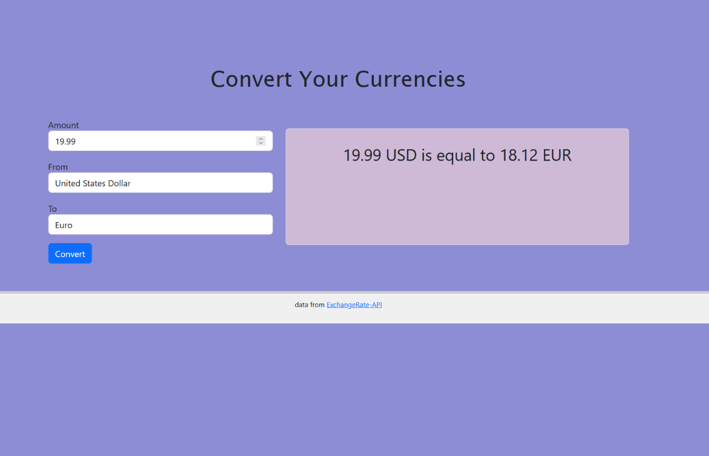

# Currency App

Responsive web page that calculates currency values using ExchangeRate-API.

## Usage

Open ```index.html``` in the top-level directory in your favorite web browser.



1. Enter the numerical amount of the currency you want to convert
2. Specify the currency you entered and the conversion using the interface.
3. Click the button to see the result.

## License

[MIT](https://choosealicense.com/licenses/mit/)